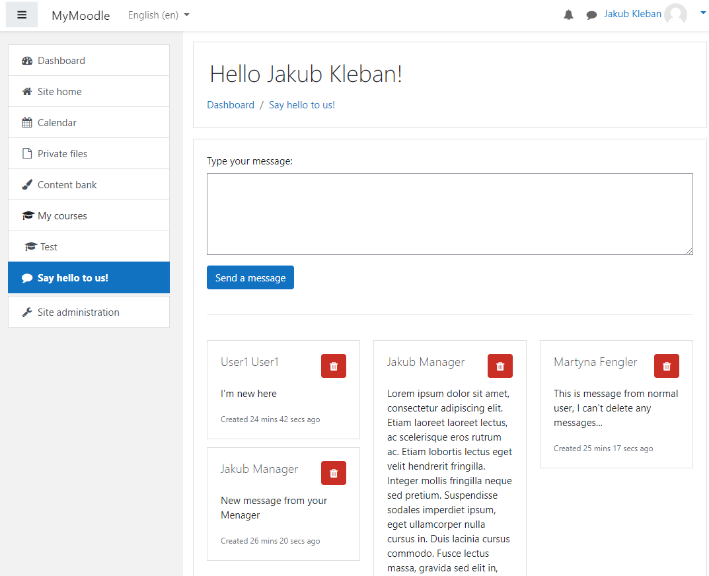

# Moodle plugin "Hello world"
Hello world plugin created for education purposes following tutorial
"*Moodle Plugin Development Basics*" on https://learn.moodle.org/.

# Description
Plugin let you to add a *social space for users* or *simplified notice board
where only a few staff members are allowed to post announcements*. 

Granular features:
* Posting a message through textarea (authenticated users)
* Viewing posted messages (all)
* Deleting any message (selected users)

Plugin supports multiple languages, themes, administration settings and database.

# Visuals

# Installation
1. Download [zip file](https://github.com/klebann/Moodle-Plugin-Helloworld/archive/main.zip).
2. Moodle -> Site administration -> Plugins -> Install plugins.

More details in [documentation](https://docs.moodle.org/39/en/Installing_plugins#Installing_a_plugin).

# Usage
Open *your_moodle_site_url/local/helloworld*
